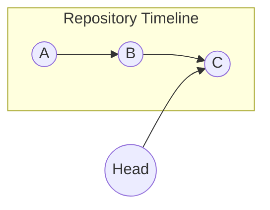
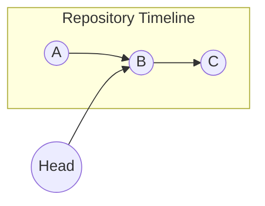

# Github Skills

[TOC]


[Basic Fetching](https://help.github.com/articles/fetching-a-remote/)
[Over Limit 100M](http://www.liuxiao.org/2017/02/git-处理-github-不允许上传超过-100mb-文件的问题/)
[Commands Summary](http://gitguide.readthedocs.io/en/latest/gitguide/)
[Git Tutorial](https://www.liaoxuefeng.com/wiki/0013739516305929606dd18361248578c67b8067c8c017b000)


## Installation

### How to install Git in macOS?

#### Homebrew

*Refer to [Homebrew](http://brew.sh/)*

```bash
$ brew install git
```

#### Config profile

```bash
$ git config --global user.name "yourName"
$ git config --global user.email "email@example.com"
```

## Create Git Repository

### Steps

1. check status for modified file(s)
2. add file(s) to stage (Git's temporary folder)
3. commit to repository

### Init Git

In the target folder:

`git init` 

A hidden `.git` folder will be creaed after successfully run `git init`

### Add file to Stage

`git add fileName.extension` 

*Note: State is the temporary folder that files to be commited*

*Note2: fileName must follow the cases*

*Note3: when added a modified file, then modify again, the second modified content would not be commited ! You can add again, then the first added file will be OVERRIDED by second added file or commit the first version and add commit the second version*

### Commit to repo

`git commit -m "message of description"` 

### Get tracked files status

`git status` 

Show modified file(s) 

*Note: only commited file will be tracked, the untracked file(s) would also be shown*

### Check modified files difference

| Action                                                       | Description                                                  |
| :----------------------------------------------------------- | ------------------------------------------------------------ |
| `git diff`                                                   | compare differences between the cached and  working directory files |
| `git diff HEAD fileName.extend` or            `git diff HEAD` | compare differences between repo and working directory files |
| `git diff --cached`                                          | compare differences between repo and cached files            |

## Commit Control

**==Note: You must need to know the concept of Git add and commit process before to control your project.==**


- #### Working Directory

  The **Working Directory** is where your project files stored in.

- #### Stage

  This **Stage** Directory is where tempararily to store added modified files, it is then wait for the commit.

- #### Repository

  The **Repository** is your version control system.

### Cancel added files (unstaged changes)

`git reset` **unstaged** all changes files (files you add into **stage** list) or

` git reset HEAD <name>` to unstaged **specified** changed file

`git reset <name>` also work as above.


### Git log

`git log` shows all detail of the commited log

- commit ID
- Author
- Date of commit
- Description

`git log —pretty=oneline`  shows only the commit ID with description

`git log --oneline` show shorter commitID like above.

### Revert commited version (version control)

- `git reset --hard head^` head point to previous version
  `head^^` point to pervious pervious version 😅
- `git reset --hard commitID` point to specified commitID (use reflog to find commitID), 
  *Note: you may use this to point to the invisible version which you are reverted.*
  *Note2: no need to input the full commitID, git will search by the given commitID*
- `git reflog` show commands that you was inputted

#### Diagram to visualize the workflow



After use `git reset --hard HEAD^`



*Note: the version C will become invisible after revert to version B, while you still can use `git reset --hard commitID` to point the head to the version C*

### Checkout

`git checkout -- fileName.extend`  to discard changes in working directory (==override the **working directory** files by **head** files (can recover your files even you deleted)==)

### Remove Stage list files

Use `git reset head fileName.extend` can discard(delete) the specified file in **stage list** (a temporary list for commit), then you can use `git checkout -- ` to overrider the local changes by `HEAD` pointed version.

*Note: if you want to discard the **stage list** and the revert the **working directory**'s file, you can simply use `git reset --hard head ` to ignore all changed either in **staged** or **working directory***

## Remote Github

### Push local Git to empty GitHub project

`git remote add origin https://github.com/userName/projectName.git` link local Git to the remote GitHub

`git push -u origin master` this`-u`push and link local master branch to the GitHub master branch

#### Example (Https):

```bash
$ git remote add origin https://github.com/iphauman/LaernGit.git
$ git push -u origin master
```

### Clone Github project to local

Before clone a Github project, you must create the project or have the repo link before to clone it.

Git support ssh potocol and http potocol where ssh is faster than http.

After created a repo, use`git clone <link> ` to clone your repo to local current path.

#### HTTPs to link GitHub

```bash
$ git clone https://github.com/userName/repoName.git
```

#### How to create SSH potocol to link GitHub?

In the root directory of user

```bash
$ ssh-keygen -t rsa -C "email@example.com"
```

Keep press enter then you may see the hidden `.ssh` folder.
The `id_rsa` is private key and `id_rsa.pub` is public key. Only the public key should be used for share your project and link the GitHub account.

After generated the SSH, add `id_rsa.pub` to your GitHub account.

#### Clone project by using SSH

```bash
$ git clone git@github.com:userName/repoName.git
```

*Notes: You will get the SSH authenticity warning at the first clone, you may check the GitHub SSH at [GitHub SSH](https://help.github.com/articles/github-s-ssh-key-fingerprints/). It then permantly added the GitHub RSA to the list of known host. (means you will not see the warning again)*

## Working with branch

### Create branch

#### Create and swith to branch

```bash
$ git branch dev
$ git checkout dev
```

- Use `git branch branchName` to create branch branchName
- Use `git checkout branchName` switch to branch branchName
- Use `git branch`  to check the current branch

 Use `git checkout` with `-b` option perform the combination command of `git branch branchName` and `git checkout branchName` like the follow

```bash
$ git checkout -b dev
```

### Merge branch

#### The workflow of branch

- At the beginning, the `HEAD` is pointed to the`master` pointer.
  The `master` is pointed to the latest version node of your project.


- When you create a branch, the **created branch** `dev` is pointed to the **source branch node** (in case master -> latest version) .
  You can switch `HEAD` to the **created branch**


- When you commited, the **created branch** will create their own linked node and point **HEAD** to it.
  Note that the **master pointer** still point to its current node.


- After finish your works with **created branch**, you can merge the branch `dev`  with `master`.

#### How to merge?

Use `git checkout master` to switch HEAD to master, then use  `git merge branchName`to merge.

#### Delete branch

Use `git branch -d branchName` to delete branch.

### Merge Mode

#### Fast-forward

When merge the master and branch, if only the branch made changes, it is simply move  `HEAD` to the merge branch node.

*Note: You cannot recover to the branch after you deleted the branch due to the `HEAD` pointed to the branch with no branch history log. So you if you want to log the branch with `Fast-forward`, you need to use `git merge --no-ff -m "message" <name>` to use the `recursive strategy` to make merge. Git will make a new commit before merge.*  

#### Conflicts

When conflicts occured in merge process, you can use `git status` to check what files is in conlicts. Then, you need to edit the conflicted file and make further commit.

After fixed the conflicts, you may use `git log --graph --oneline` to visualize the project timeline to see the   merge history.


### Conclusion

`git branch` : check branchs

`git branch <name>` : create new branch from **current branch**

`git checkout <name>` : switch to branch

`git checkout -b <name>` : create and switch to new branch from **current branch**

`git merge <name>` : merge branch with **current branch**

`git branch -d <name>` : delete branch

